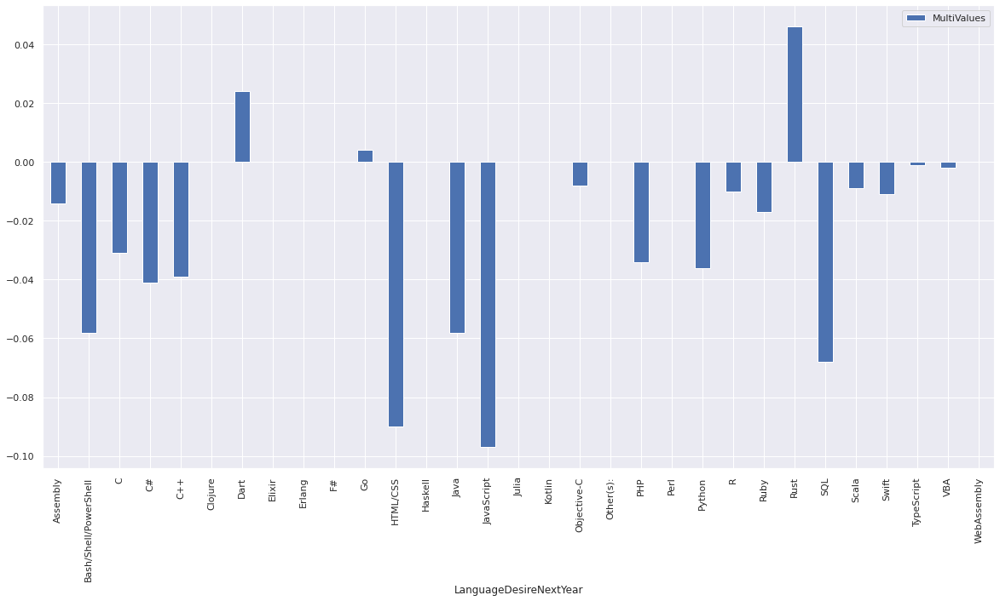
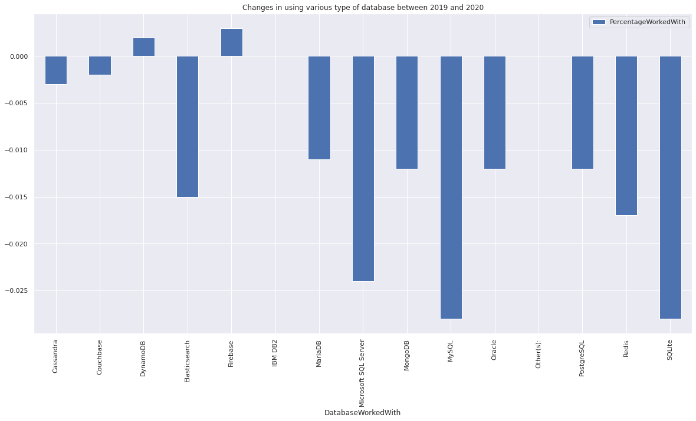
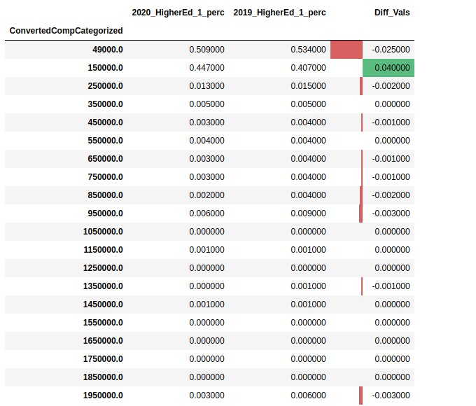
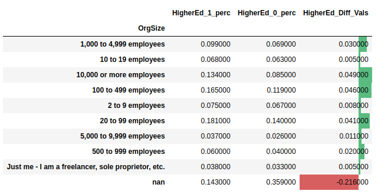
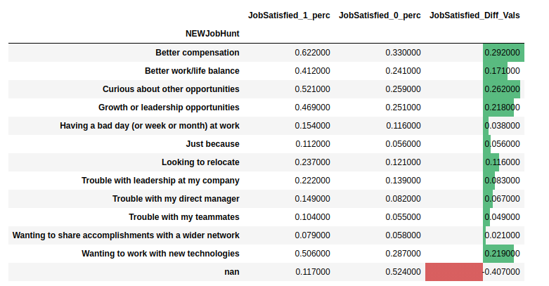

##### Stackoverflow Survey 2020 Analysis
# This will make you rethink what keeps developers satisfied at thier job
A data based approach using Stack Overflow’s developer survey data from 2020.

## Introdution
In the software and tech-industry developers are playing a key role on building products and advancing the technology. 
Their existence and contributions are very crucial for success of big project. Organizations from different size are 
actively trying to higher good developers and also keep their current best developers satisfied at their workplace.

There are multiple reason which cause developers to change their organization, better prospect, working condition, or 
because they are not satisfied with their current working condition. I personally have my own point of view on the
subject. However, it is helpful to have a look at the broad landscape of the software development and engineering to 
gather some insight on developers interest and wishes.

  Therefore, I used data from Stackoverflow’s [2020 Annual Developer Survey](https://insights.stackoverflow.com/survey), to take a 
closer look at this questions. The survey collect information from 64,000 reviews from 183 countries and territories. 
The survey aims to understand multiple aspects of jobs related to software development and data analytics. There were more than 63 questions 
as a part of the survey, including:

* *Which of the following best describes the highest level of formal education that you’ve completed?*

* *How satisfied are you with your current job?*

* *Imagine that you are deciding between two job offers with the same compensation, benefits, and location.*

* *How frequently do you learn a new language or framework?*

## Part I: How the Technology and Tech Culture looks like
Generally speaking we can gain knowledge about technological landscape and recent developments in software related industries
including Mobile and Web Apps, hardware programming, self-driving car, etc..., by looking at what trend developers are
pursuing and how their choice of programming language, operation system, database have change during recent past few years.

On these tree graphs we compare the trends in Database, Programming Language, and Technology usage of developers from 
year 2019 to the year 2020. Looking one year back we can gain some insight on that are new interests. 
It is visible that developers are showing more interest in programming language such as "Rust" which guaranties safety 
and security and at the same time reduces the complexity of garbage collection and memory checking. The same pattern 
appears in using development kit like "Flutter" which is a brand new coding environment that enables fast and convenient 
development. It can be said that developers are looking for combination programming languages and software developing kits which make their life easier by preserving the 
practicality. 

## Part II: How higher education plays a role?

For organizations its important to add well educated and expert developer into their workforce. Offering attractive salary 
and employment packages is one of the key players in highers such developers. based on graphic between year 2019 and 2020
there was increase in the number of developers with 6 digit salaries.

On the level organization level it is hard to make judgment where the developer with higher education work. But based on the 
graphic below most of the well educated developers in the year 2020 tend to work in middle size or smaller companies.

## Part III: what correlates with job satisfaction

After all what keeps expert developer happy and keeps them in the company they are working for a long time? Answer to
this question is not only salary and high payment but why and how developer are looking for new opportunities. What is 
their demographic, education background what other parameter correlate with job satisfaction of the developer. 

Next to better compensation growth or leadership opportunities and being curious about other opportunities also are major
reason why developers leave a company and look for new job. In comparison to year 2019 number of developer who actively 
are looking for new positions has increased. Overall developer are passively looking for new opportunities.

## Conclusion
In this article focused on what keep developers in their job according to Stack Overflow 2019 and 2020 survey data.
* we took a look at software and technology landscape and what is trending among developers 
* we observed salary and payment distribution look like for developers with higher eduction.
* we developer passively look for new opportunities regardless if they are satisfied in their current position.
